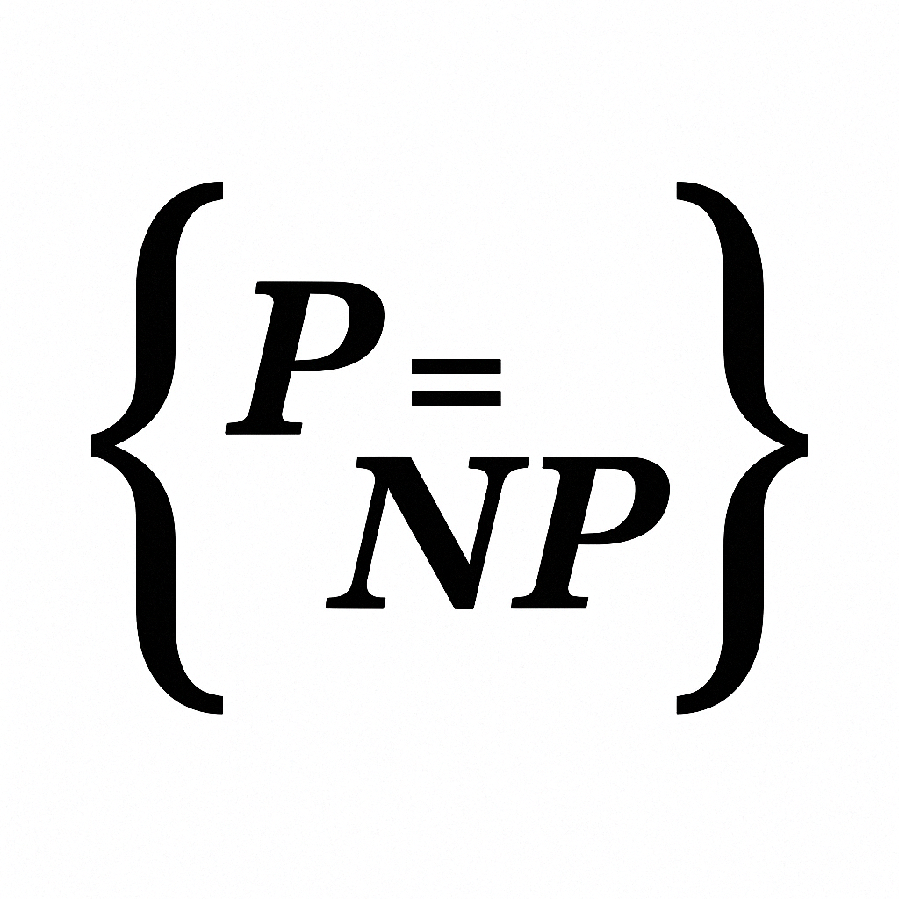

  

# Hybrid Obstructions for P ≠ NP

🚀 Independent project by **Noam Arnon** — developer & math enthusiast  
Exploring the frontier of the P vs NP problem using hybrid techniques from algebraic geometry, quantum topology, category theory, and more.

---

## 🔍 Overview

This repository presents a bold, cross-disciplinary framework exploring the **P vs NP** problem.  
It combines multiple approaches — algebraic, geometric, quantum, and logical — into a unified research prototype.

---

## 📂 Project Structure

| Folder         | Description |
|----------------|-------------|
| [`spd/`](./spd)         | Shifted Partial Derivatives obstructions |
| [`sos/`](./sos)         | Sum-of-Squares proof sketches |
| [`pcp/`](./pcp)         | Algebraic PCP-style consistency checks |
| [`quantum/`](./quantum) | Quantum proof lower bounds and No-Cloning strategies |
| [`tropical/`](./tropical) | Tropical geometry comparisons between Perm and Det |
| [`motivic/`](./motivic) | Point counting over finite fields |
| [`hodge/`](./hodge)     | Hodge-theoretic invariants |
| [`categorical/`](./categorical) | K-theory & derived category differences |
| [`tqft/`](./tqft)       | TQFT knot invariants (e.g., Jones polynomial) |
| 📄 [`gct_obstructions.tex`](./gct_obstructions.tex) | Full writeup of the hybrid obstruction framework |

---

## 🧠 Who is this for?

If you're a:

- Computational complexity theorist  
- Algebraic geometer  
- Quantum / topological researcher  
- Lean / Coq formalist  
- Curious student or contributor

→ You're invited to collaborate, criticize, test, or expand this framework.

---

## 🤝 Call for Collaboration

This is an open invitation. I’m not an academic, but I’ve built this out of passion and rigor.  
If you see potential — join me in refining, expanding, or even transforming this into something that lasts.

Feel free to contact me via GitHub or open an issue or discussion.

---

## 📜 License

This work is released under the [MIT License](./LICENSE).  
Use freely, build boldly — just give credit.

---
